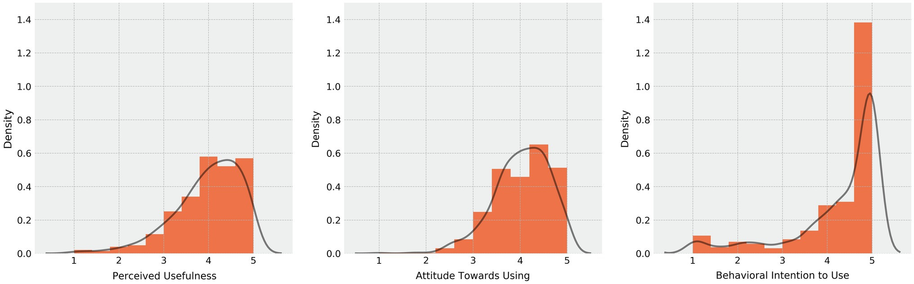

__Abstract__ \
Music streaming services (MSS) offer their users numerous ways of choosing and implementing their individual approaches to music listening. Personality, uses of music, and the acceptance of MSS can be conceptualized as interdependent. This study investigates whether negative affect modulation strategies explain differences in the acceptance of MSS and integrates findings from previous research into a structural equation model. As for measurements, the Big Five Inventory 2, the Inventory for the Assessment of Activation and Arousal modulation through Music, and adapted scales from previous research on the Technology Acceptance Model were used. A convenience sample of 825 participants (24.3 years; 74% females and 89% students) successfully completed an online questionnaire. In total, 89 percent of the sample reported using MSS regularly. The results show that the tendency to modulate negative affect through music is positively influenced by openness and neuroticism. In turn, the tendency to modulate negative affect through music is shown to increase the perceived usefulness of MSS. However, this study failed to replicate the previous findings that openness increases the attitude toward using and that neuroticism decreases the perceived usefulness. This implies that uses of music are more effective than personality traits at predicting the individual acceptance of MSS. However, personality can be viewed as a predictor for uses of music. The interwovenness of stable and situational factors of music choices is supported. MSS seem to assist their users in coping with negative affect in everyday life, increasing wellbeing. MSS should expand their personalization features to optimize user experience with respect to individual uses of music.

Read the full article at [Frontiers in Psychology](https://www.frontiersin.org/articles/10.3389/fpsyg.2021.659062/full).
